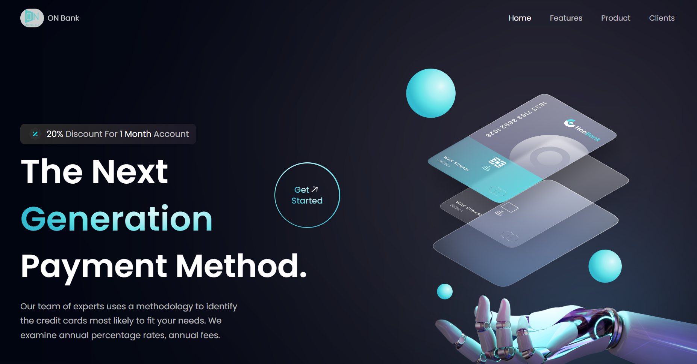

<div align="center">
# 🏦 ON Modern Bank

*A responsive React JS banking website with elegant design and reusable components using Tailwind CSS* 🚀

  
  


</div>

## 📘 Table of Contents
1. [Introduction](#introduction) 🧭  
2. [Technologies](#technologies) 💻  
3. [Features](#features) 🚀  
4. [Getting Started](#getting-started) ⚙️  
5. [Acknowledgements](#acknowledgements) 💙  
6. [Contact](#contact) 🌐  

## 🧭 <a name="introduction">Introduction</a>

Welcome to **ON Modern Bank**, a visually striking and fully responsive banking website built with **React** and **Tailwind CSS**. This project represents a key milestone in my learning journey—showcasing not only my ability to design modern UIs but also to structure reusable components for scalability.

The goal was to replicate a sleek, professional online bank layout suitable for portfolio demonstration. Despite initial complexity in file structuring, I gradually adapted to the React ecosystem and learned to handle challenges such as responsive design, component reuse, and directory management.

If you're looking to explore clean front-end architecture with a strong focus on UI/UX, this project is for you.

## 💻 <a name="technologies">Technologies</a>

<div align="center">
  
</div>

- **ReactJS:** JavaScript library for building dynamic UIs using components.
- **TailwindCSS:** Utility-first CSS framework for modern responsive design.
- **Vite:** Lightning-fast front-end build tool for development.
- **Git:** Version control system for managing source code.
- **Netlify / Vercel / GitHub Pages (Optional):** For quick deployment.

## 🚀 <a name="features">Features</a>

- **🔷 Responsive Navbar:** Fully responsive and collapsible navigation menu.
- **🔷 Eye-catching Hero Section:** High-quality hero area with a CTA and engaging visuals.
- **🔷 Service Highlights:** Display banking benefits and services with icon cards.
- **🔷 Billing & Transactions:** Information layout simulating user billing overview.
- **🔷 Credit Card Section:** Showcase best card deals with smooth transitions.
- **🔷 Testimonials:** Client reviews for building trust and credibility.
- **🔷 Footer:** Clean footer with links and branding.

<div align="center">
  
  
  <br>
  
  
</div>

## ⚙️ <a name="getting-started">Getting Started</a>

### 🖥️ Development

#### 1. Clone the Repository
```bash
git clone https://github.com/OriginalNVK/Modern-Bank.git
cd Modern-Bank
```

#### 2. Install Dependencies
```bash
npm install
```

#### 3. Run the Development Server
```bash
npm run dev
```

#### 4. Open the browser and navigate to:
```
http://localhost:5173
```

You should see the ON Modern Bank homepage. You can now begin customizing components or styling as needed.

### 🚀 Deployment Options
You can deploy this project using:
- **Vercel** — great for React apps.
- **Netlify** — easy Git integration.
- **GitHub Pages** — free and straightforward.

## 💙 <a name="acknowledgements">Acknowledgements</a>

- **JS Mastery** for inspiring designs and high-quality tutorials.
- **React Docs** for solid fundamentals.
- **Tailwind CSS** for an amazing utility-first CSS framework.
- **Vite** for fast development tooling.

## 🌐 <a name="contact">Contact</a>

- **Name:** Khánh
- **GitHub:** [originalNVK](https://github.com/originalNVK)
- **Email:** khanh25051999@gmail.com
